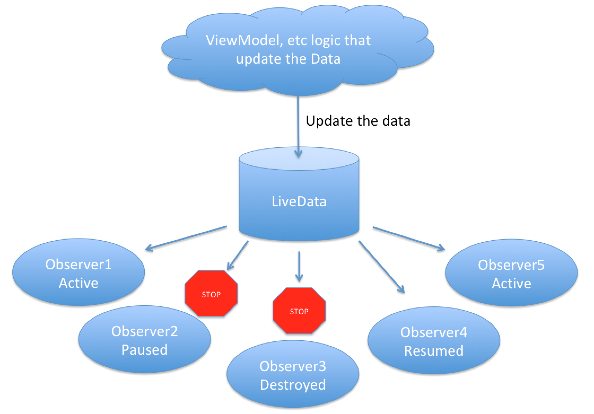

# mvvm-notes
Notes of studying about Model View View-Model architecture, and Repository design pattern.

Sources:
  * https://www.youtube.com/watch?v=ijXjCtCXcN4&list=PLgCYzUzKIBE8M2SMSIEZ6jJepG6qD0ugX&index=4&t=1146s
  * https://codingwithmitch.com/blog/getting-started-with-mvvm-android/
  * https://medium.com/@elye.project/understanding-live-data-made-simple-a820fcd7b4d0

## Benefits
  * UI kept away from business logic
  * Business logic kept away from DB operations
  * **Easy to understand and read**
  * Less worries about lifecycle events (ex. screen rotations)

## Why not regularly used?
Many people still don't know about it.

But it's the best structure in most situations.

## Architecture

  * ViewModel: a custom class that extends ViewModel. It is a model for the view.
  * Ex:
    * View: a RecyclerView.
    * Model: A list of locations.
    * ViewModel: All the data displayed on the screen: Images with their Names.
    * Repository: a kind of hub. 1 repository being fed with all the data sources.

  * Note: Use **Coordinator Layout** for a floating view on top of other views.

## LiveData and MutableLiveData
  * are data types in MVVM to observe changes in data.
  * LiveData = an observable data holder class, but lifecycle-aware -> it only updates component observers in an active lifecycle state.
    * Unlike RxJava, it doesn't blindly notify all observers, but first checks their live state.
      * No need to unsubscribe it in onPause or onDestroy (as in Rx).
    * Once observber is resumed, it would be notified of the latest data from the LiveData.
  
    * `LiveData` itself is an Abstract Class -> Can't be instantiated directly.
      * Use one type of LiveData implementations described in [Types of LiveData](#types-of-livedata)
  * dependency in build.gradle:
    ```
    // Lifecycle components
    def archLifecycleVersion = '1.1.1'
    implementation "android.arch.lifecycle:extentions:$archLifecycleVersion"
    annotationProcessor "android.arch.lifecycle:compiler$archLifecycleVersion"
    ```
  * Common packaging for MVVM:
    * models package
    * repositories package
    * viewmodels package
    * adapters and other UI (view) packages
  * ViewModels namings:
    * Some prefer ViewModels named after Activity or Fragment they are connecting to.
    * Some prefer ViewModels named after the object class they're modeling.
  * Defining LiveData:
    ```java
    private MutableLiveData<List<NicePlace>> mNicePlaces;
    ```
  * `MutableLiveData` is a subclass of `LiveData`.
  * Recall: *Singleton pattern*
    ```java
    public class Repo{
        private static Repo instance;
        private ArrayList<Data> dataSet = new ArrayList<>();

        public static Repo getInstance(){
            if(instance == null){
                instance = new Repo();
            }
            return instance;
        }
    }
    ```
  * Declaration of a Repository:
    ```java
    public class NicePlaceRepository{
        private static NicePlaceRepository instance;
        private ArrayList<NicePlace> dataSet = new ArrayList<>();

        public static NicePlaceRepository getInstance(){
            if(instance == null){
                instance = new NicePlaceRepository();
            }
            return instance;
        }

        public MutableLiveData<List<NicePlace>> getNicePlaces(){
            retrieveNicePlaces();

            MutableLiveData<List<NicePlace>> liveData = new MutableLiveData<>();
            liveData.setValue(dataSet);
            return liveData;
        }
    }
    ```
  * Declaration of a ViewModel:
    ```java
    public class MainActivityViewModel extends ViewModel{
        private MutableLiveData<List<NicePlace>> mNicePlaces;
        private NicePlaceRepository mRepo;
        private MutableLiveData<Boolean> mIsUpdating = new MutableLiveData<>();

        public void init(){
            if(mNicePlaces!=null){
                return;
            }
            mRepo = NicePlaceRepository.getInstance();
            mNicePlaces = mRepo.getNicePlaces();
        }

        public void addNewValue(final NicePlace nicePlace){
            mIsUpdating.setValue(true);

            //AsyncTask to sleep for 2 sec in background, add new nicePlace to mNicePlaces and setting mIsUpdating to false
        }

        public LiveData<List<NicePlace>> getNicePlaces(){
            return mNicePlaces;
        }

        public LiveData<Boolean> getIsUpdating(){
            return mIsUpdating;
        }
    }
    ```
  * Getting an instance of a ViewModel and using it in an Activity:
    ```java
    mMainActivityViewModel = ViewModelProviders.of(this).get(MainActivityViewModel.class);

    // Retrieves LiveData from the repository
    mMainActivityViewModel.init();

    // LiveData is very similar to Rx Observables.
    mMainActivityViewModel.getNicePlaces().observe(this, new Observer<List<NicePlace>>(){
        @Override
        public void onChanged(@Nullable List<NicePlace> nicePlaces){
          mAdapter.notifyDataSetChanged();
        }
    });

    mMainActivityViewModel.getIsUpdating().observe(this, new Observer<Boolean>(){
        @Override
        public void onChanged(@Nullable Boolean aBoolean){
            if(aBoolean){
                showProgressBar();
            }else{
                hideProgressBar();
            }
        }
    })
    ```

## Key Benefits of MVVM
  * None of the business logic is done in the activity java code.
  * Android activity is hard to be unit tested but ViewModel and LiveData are easier.
    * That's why logic side is done in Presenter (MVP), ViewModel (MVVM), Controller(MVC), etc.

## Types of LiveData
